# Goodness-of-fit measures to compare observed and simulated time series with hydroGOF

## Citation

If you use *[hydroGOF](https://cran.r-project.org/package=hydroGOF)*,
please cite it as Zambrano-Bigiarini (2026):

Zambrano-Bigiarini, M. (2026) hydroGOF: Goodness-of-fit functions for
comparison of simulated and observed hydrological time series R package
version 0.7-0. URL: <https://cran.r-project.org/package=hydroGOF>.
<doi:10.32614/CRAN.package.hydroGOF>.

## Installation

Installing the latest stable version (from
[CRAN](https://cran.r-project.org/package=hydroGOF)):

``` r

install.packages("hydroGOF")
```

Alternatively, you can also try the under-development version (from
[Github](https://github.com/hzambran/hydroGOF)):

``` r

if (!require(devtools)) install.packages("devtools")
library(devtools)
install_github("hzambran/hydroGOF")
```

## Setting up the environment

Loading the *hydroGOF* package, which contains data and functions used
in this analysis:

``` r

library(hydroGOF)
```

    ## Loading required package: zoo

    ## 
    ## Attaching package: 'zoo'

    ## The following objects are masked from 'package:base':
    ## 
    ##     as.Date, as.Date.numeric

## Example using NSE

The following examples use the well-known Nash-Sutcliffe efficiency
(NSE), but you can repeat the computations using any of the
goodness-of-fit measures included in the *hydroGOF* package (e.g., KGE,
ubRMSE, dr).

### Ex 1: ideal integer values

Basic ideal case with a numeric sequence of integers:

``` r

obs <- 1:10
sim <- 1:10
NSE(sim, obs)
```

    ## [1] 1

``` r

obs <- 1:10
sim <- 2:11
NSE(sim, obs)
```

    ## [1] 0.8787879

### Ex 2: ideal real values

Basic ideal case with a numeric sequence of integers:

``` r

obs <- 1:10 + 0.1
sim <- 1:10 +0.1
NSE(sim, obs)
```

    ## [1] 1

``` r

obs <- 1:10 + 0.1
sim <- 2:11 + 0.1
NSE(sim, obs)
```

    ## [1] 0.8787879

### Ex 3: ideal daily ts

From this example onwards, a streamflow time series will be used.

First, we load the daily streamflows of the Ega River (Spain), from 1961
to 1970:

``` r

data(EgaEnEstellaQts)
obs <- EgaEnEstellaQts
```

Generating a simulated daily time series, initially equal to the
observed series:

``` r

sim <- obs 
```

Visualising the observed and simulated time series:

``` r

ggof(sim, obs)
```

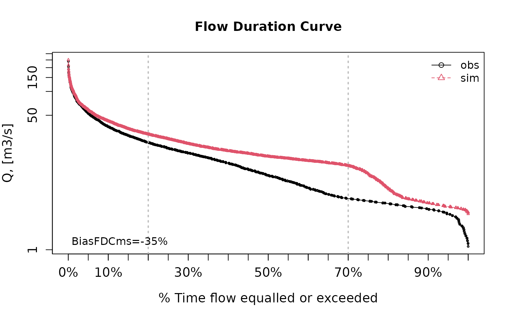

Computing the ‘NSE’ for the “best” (unattainable) case

``` r

NSE(sim=sim, obs=obs)
```

    ## [1] 1

### Ex 4: random noise in the first half of the simulated values

NSE for simulated values equal to observations plus random noise on the
first half of the observed values.

This random noise has more relative importance for low flows than for
medium and high flows.

Randomly changing the first 1826 elements of ‘sim’, by using a normal
distribution with mean 10 and standard deviation equal to 1 (default of
‘rnorm’).

``` r

sim[1:1826] <- obs[1:1826] + rnorm(1826, mean=10)
ggof(sim, obs)
```

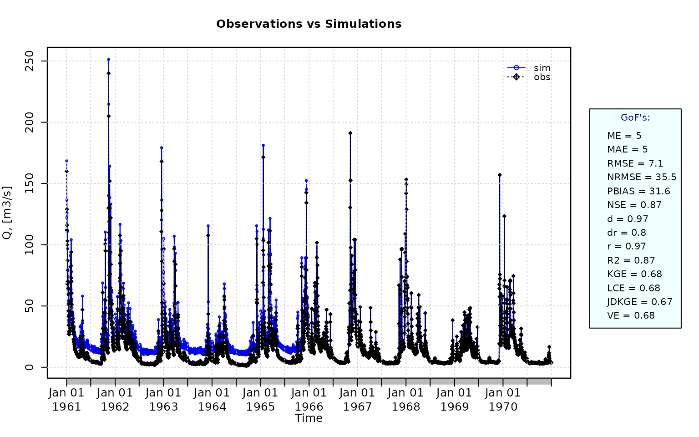

``` r

NSE(sim=sim, obs=obs)
```

    ## [1] 0.8739885

Let’s have a look at other goodness-of-fit measures:

``` r

mNSE(sim=sim, obs=obs)                 # Modified NSE
```

    ## [1] 0.6049584

``` r

rNSE(sim=sim, obs=obs)                 # Relative NSE
```

    ## [1] -0.5687206

``` r

wNSE(sim=sim, obs=obs)                 # Weighted NSE
```

    ## [1] 0.9769178

``` r

wsNSE(sim=sim, obs=obs)                # Weighted Seasonal NSE
```

    ## [1] 0.9686072

``` r

KGE(sim=sim, obs=obs)                  # Kling-Gupta efficiency (KGE), 2009
```

    ## [1] 0.6805856

``` r

KGE(sim=sim, obs=obs, method="2012")   # Kling-Gupta efficiency (KGE), 2012
```

    ## [1] 0.61689

``` r

KGE(sim=sim, obs=obs, method="2021")   # Kling-Gupta efficiency (KGE), 2021
```

    ## [1] 0.7461172

``` r

KGElf(sim=sim, obs=obs)                # KGE for low flows
```

    ## [1] 0.5170138

``` r

KGEnp(sim=sim, obs=obs)                # Non-parametric KGE
```

    ## [1] 0.6340134

``` r

sKGE(sim=sim, obs=obs)                 # Split KGE
```

    ## [1] 0.6547522

``` r

KGEkm(sim=sim, obs=obs)                # Knowable Moments KGE
```

    ## [1] 0.6467934

``` r

JDKGE(sim=sim, obs=obs)                # Joint Divergence KGE
```

    ## [1] 0.6080188

``` r

d(sim=sim, obs=obs)                    # Index of Agreement
```

    ## [1] 0.9697286

``` r

dr(sim=sim, obs=obs)                   # Refined Index of Agreement
```

    ## [1] 0.8024792

``` r

md(sim=sim, obs=obs)                   # Modified Index of Agreement
```

    ## [1] 0.7980307

``` r

rd(sim=sim, obs=obs)                   # Relative Index of Agreement
```

    ## [1] 0.6231506

``` r

VE(sim=sim, obs=obs)                   # Volumetric Efficiency
```

    ## [1] 0.6838531

``` r

cp(sim=sim, obs=obs)                   # Coefficient of Persistence
```

    ## [1] 0.4683536

``` r

APFB(sim=sim, obs=obs)                 # Annual Peak Flow Bias
```

    ## [1] 0.03202514

``` r

HFB(sim=sim, obs=obs)                  # High Flow Bias
```

    ## [1] 0.08706977

``` r

LME(sim=sim, obs=obs)                  # Liu-Mean Efficiency
```

    ## [1] 0.6838398

``` r

LCE(sim=sim, obs=obs)                  # Lee and Choi Efficiency
```

    ## [1] 0.6777786

``` r

PMR(sim=sim, obs=obs)                  # Proxy for Model Robustness
```

    ## [1] 0.3156247

``` r

pbias(sim=sim, obs=obs)                # Percent bias (PBIAS)
```

    ## [1] 31.6

``` r

pbiasfdc(sim=sim, obs=obs)             # PBIAS in the slope of the midsegment of the FDC
```

    ## [Note: 'thr.shw' was set to FALSE to avoid confusing legends...]


    ## [1] -34.95419

``` r

me(sim=sim, obs=obs)                   # Mean Error
```

    ## [1] 4.998998

``` r

mae(sim=sim, obs=obs)                  # Mean Absolute Error
```

    ## [1] 4.998998

``` r

mse(sim=sim, obs=obs)                  # Mean Squared Error 
```

    ## [1] 50.46771

``` r

rmse(sim=sim, obs=obs)                 # Root Mean Square Error (RMSE)
```

    ## [1] 7.104063

``` r

ubRMSE(sim=sim, obs=obs)               # Unbiased RMSE
```

    ## [1] 5.047547

``` r

nrmse(sim=sim, obs=obs, norm="sd")     # Normalised Root Mean Square Error
```

    ## [1] 35.5

``` r

nrmse(sim=sim, obs=obs, norm="maxmin") # Normalised Root Mean Square Error
```

    ## [1] 3

``` r

nrmse(sim=sim, obs=obs, norm="mean")   # Normalised Root Mean Square Error
```

    ## [1] 44.9

``` r

nrmse(sim=sim, obs=obs, norm="IQR")    # Normalised Root Mean Square Error
```

    ## [1] 47.1

``` r

rPearson(sim=sim, obs=obs)             # Pearson correlation coefficient
```

    ## [1] 0.9698058

``` r

rSpearman(sim=sim, obs=obs)            # Spearman rank correlation coefficient
```

    ## [1] 0.8362479

``` r

R2(sim=sim, obs=obs)                   # Coefficient of determination (R2)
```

    ## [1] 0.8739885

``` r

br2(sim=sim, obs=obs)                  # R2 multiplied by the slope of the regression line
```

    ## [1] 0.7780545

### Ex 5: random noise and logarithmic transformation

NSE for simulated values equal to observations plus random noise on the
first half of the observed values and applying (natural) logarithm to
*obs* against *sim* during computations.

``` r

NSE(sim=sim, obs=obs, fun=log)
```

    ## [1] 0.4799297

Verifying the previous value:

``` r

lsim <- log(sim)
lobs <- log(obs)
NSE(sim=lsim, obs=lobs)
```

    ## [1] 0.4799297

Let’s have a look at other goodness-of-fit measures:

``` r

mNSE(sim=sim, obs=obs)                 # Modified NSE
```

    ## [1] 0.6049584

``` r

rNSE(sim=sim, obs=obs)                 # Relative NSE
```

    ## [1] -0.5687206

``` r

wNSE(sim=sim, obs=obs)                 # Weighted NSE
```

    ## [1] 0.9769178

``` r

wsNSE(sim=sim, obs=obs)                # Weighted Seasonal NSE
```

    ## [1] 0.9686072

``` r

KGE(sim=sim, obs=obs)                  # Kling-Gupta efficiency (KGE), 2009
```

    ## [1] 0.6805856

``` r

KGE(sim=sim, obs=obs, method="2012")   # Kling-Gupta efficiency (KGE), 2012
```

    ## [1] 0.61689

``` r

KGE(sim=sim, obs=obs, method="2021")   # Kling-Gupta efficiency (KGE), 2021
```

    ## [1] 0.7461172

``` r

KGElf(sim=sim, obs=obs)                # KGE for low flows
```

    ## [1] 0.5170138

``` r

KGEnp(sim=sim, obs=obs)                # Non-parametric KGE
```

    ## [1] 0.6340134

``` r

sKGE(sim=sim, obs=obs)                 # Split KGE
```

    ## [1] 0.6547522

``` r

KGEkm(sim=sim, obs=obs)                # Knowable Moments KGE
```

    ## [1] 0.6467934

``` r

JDKGE(sim=sim, obs=obs)                # Joint Divergence KGE
```

    ## [1] 0.6080188

``` r

d(sim=sim, obs=obs)                    # Index of Agreement
```

    ## [1] 0.9697286

``` r

dr(sim=sim, obs=obs)                   # Refined Index of Agreement
```

    ## [1] 0.8024792

``` r

md(sim=sim, obs=obs)                   # Modified Index of Agreement
```

    ## [1] 0.7980307

``` r

rd(sim=sim, obs=obs)                   # Relative Index of Agreement
```

    ## [1] 0.6231506

``` r

VE(sim=sim, obs=obs)                   # Volumetric Efficiency
```

    ## [1] 0.6838531

``` r

cp(sim=sim, obs=obs)                   # Coefficient of Persistence
```

    ## [1] 0.4683536

``` r

APFB(sim=sim, obs=obs)                 # Annual Peak Flow Bias
```

    ## [1] 0.03202514

``` r

HFB(sim=sim, obs=obs)                  # High Flow Bias
```

    ## [1] 0.08706977

``` r

LME(sim=sim, obs=obs)                  # Liu-Mean Efficiency
```

    ## [1] 0.6838398

``` r

LCE(sim=sim, obs=obs)                  # Lee and Choi Efficiency
```

    ## [1] 0.6777786

``` r

PMR(sim=sim, obs=obs)                  # Proxy for Model Robustness
```

    ## [1] 0.3156247

``` r

pbias(sim=sim, obs=obs)                # Percent bias (PBIAS)
```

    ## [1] 31.6

``` r

pbiasfdc(sim=sim, obs=obs)             # PBIAS in the slope of the midsegment of the FDC
```

    ## [Note: 'thr.shw' was set to FALSE to avoid confusing legends...]


    ## [1] -34.95419

``` r

me(sim=sim, obs=obs)                   # Mean Error
```

    ## [1] 4.998998

``` r

mae(sim=sim, obs=obs)                  # Mean Absolute Error
```

    ## [1] 4.998998

``` r

mse(sim=sim, obs=obs)                  # Mean Squared Error 
```

    ## [1] 50.46771

``` r

rmse(sim=sim, obs=obs)                 # Root Mean Square Error (RMSE)
```

    ## [1] 7.104063

``` r

ubRMSE(sim=sim, obs=obs)               # Unbiased RMSE
```

    ## [1] 5.047547

``` r

nrmse(sim=sim, obs=obs, norm="sd")     # Normalised Root Mean Square Error
```

    ## [1] 35.5

``` r

nrmse(sim=sim, obs=obs, norm="maxmin") # Normalised Root Mean Square Error
```

    ## [1] 3

``` r

nrmse(sim=sim, obs=obs, norm="mean")   # Normalised Root Mean Square Error
```

    ## [1] 44.9

``` r

nrmse(sim=sim, obs=obs, norm="IQR")    # Normalised Root Mean Square Error
```

    ## [1] 47.1

``` r

rPearson(sim=sim, obs=obs)             # Pearson correlation coefficient
```

    ## [1] 0.9698058

``` r

rSpearman(sim=sim, obs=obs)            # Spearman rank correlation coefficient
```

    ## [1] 0.8362479

``` r

R2(sim=sim, obs=obs)                   # Coefficient of determination (R2)
```

    ## [1] 0.8739885

``` r

br2(sim=sim, obs=obs)                  # R2 multiplied by the slope of the regression line
```

    ## [1] 0.7780545

### Ex 6: random noise, logarithmic transformation and Pushpalatha2012 constant

NSE for simulated values equal to observations plus random noise on the
first half of the observed values and applying (natural) logarithm to
*obs* against *sim* and adding the Pushpalatha2012 constant during
computations.

``` r

NSE(sim=sim, obs=obs, fun=log, epsilon.type="Pushpalatha2012")
```

    ## [1] 0.4871177

Verifying the previous value, with the epsilon value following
Pushpalatha2012:

``` r

eps  <- mean(obs, na.rm=TRUE)/100
lsim <- log(sim+eps)
lobs <- log(obs+eps)
NSE(sim=lsim, obs=lobs)
```

    ## [1] 0.4871177

Let’s have a look at other goodness-of-fit measures:

``` r

gof(sim=sim, obs=obs, fun=log, epsilon.type="Pushpalatha2012", do.spearman=TRUE, do.pbfdc=TRUE, do.pmr=TRUE)
```

    ##              [,1]
    ## ME           0.41
    ## MAE          0.41
    ## MSE          0.46
    ## RMSE         0.68
    ## ubRMSE       0.54
    ## NRMSE %     71.60
    ## PBIAS %     18.20
    ## RSR          0.72
    ## rSD          0.89
    ## NSE          0.49
    ## mNSE         0.48
    ## rNSE        -2.08
    ## wNSE         0.74
    ## wsNSE        0.78
    ## d            0.86
    ## dr           0.74
    ## md           0.74
    ## rd           0.18
    ## cp          -7.68
    ## r            0.83
    ## R2           0.49
    ## bR2          0.44
    ## VE           0.82
    ## KGE          0.72
    ## KGElf        0.52
    ## KGEnp        0.74
    ## KGEkm        0.74
    ## JDKGE        0.72
    ## LME          0.68
    ## LCE          0.67
    ## sKGE         0.53
    ## APFB         0.01
    ## HFB          0.02
    ## rSpearman    0.84
    ## pbiasFDC % -45.87
    ## PMR          0.20

### Ex 7: random noise, logarithmic transformation and user-defined constant

NSE for simulated values equal to observations plus random noise on the
first half of the observed values and applying (natural) logarithm to
*obs* against *sim* and adding a user-defined constant during
computations

``` r

eps <- 0.01
NSE(sim=sim, obs=obs, fun=log, epsilon.type="otherValue", epsilon.value=eps)
```

    ## [1] 0.4804

Verifying the previous value:

``` r

lsim <- log(sim+eps)
lobs <- log(obs+eps)
NSE(sim=lsim, obs=lobs)
```

    ## [1] 0.4804

Let’s have a look at other goodness-of-fit measures:

``` r

gof(sim=sim, obs=obs, fun=log, epsilon.type="otherValue", epsilon.value=eps, do.spearman=TRUE, do.pbfdc=TRUE, do.pmr=TRUE)
```

    ##              [,1]
    ## ME           0.42
    ## MAE          0.42
    ## MSE          0.48
    ## RMSE         0.69
    ## ubRMSE       0.55
    ## NRMSE %     72.10
    ## PBIAS %     18.70
    ## RSR          0.72
    ## rSD          0.88
    ## NSE          0.48
    ## mNSE         0.48
    ## rNSE        -4.22
    ## wNSE         0.74
    ## wsNSE        0.78
    ## d            0.86
    ## dr           0.74
    ## md           0.74
    ## rd          -0.39
    ## cp          -7.93
    ## r            0.82
    ## R2           0.48
    ## bR2          0.43
    ## VE           0.81
    ## KGE          0.72
    ## KGElf        0.51
    ## KGEnp        0.74
    ## KGEkm        0.73
    ## JDKGE        0.71
    ## LME          0.67
    ## LCE          0.66
    ## sKGE         0.48
    ## APFB         0.01
    ## HFB          0.02
    ## rSpearman    0.84
    ## pbiasFDC % -46.36
    ## PMR          0.21

### Ex 8: random noise, logarithmic transformation and user-defined factor

NSE for simulated values equal to observations plus random noise on the
first half of the observed values and applying (natural) logarithm to
*obs* against *sim* and using a user-defined factor to multiply the mean
of the observed values to obtain the constant to be added to *obs*
against *sim* during computations

``` r

fact <- 1/50
NSE(sim=sim, obs=obs, fun=log, epsilon.type="otherFactor", epsilon.value=fact)
```

    ## [1] 0.4938294

Verifying the previous value:

``` r

fact <- 1/50
eps  <- fact*mean(obs, na.rm=TRUE)
lsim <- log(sim+eps)
lobs <- log(obs+eps)
NSE(sim=lsim, obs=lobs)
```

    ## [1] 0.4938294

Let’s have a look at other goodness-of-fit measures:

``` r

gof(sim=sim, obs=obs, fun=log, epsilon.type="otherFactor", epsilon.value=fact, do.spearman=TRUE, do.pbfdc=TRUE, do.pmr=TRUE)
```

    ##              [,1]
    ## ME           0.41
    ## MAE          0.41
    ## MSE          0.44
    ## RMSE         0.66
    ## ubRMSE       0.52
    ## NRMSE %     71.10
    ## PBIAS %     17.60
    ## RSR          0.71
    ## rSD          0.89
    ## NSE          0.49
    ## mNSE         0.48
    ## rNSE        -1.33
    ## wNSE         0.74
    ## wsNSE        0.78
    ## d            0.87
    ## dr           0.74
    ## md           0.74
    ## rd           0.38
    ## cp          -7.43
    ## r            0.83
    ## R2           0.49
    ## bR2          0.44
    ## VE           0.82
    ## KGE          0.73
    ## KGElf        0.53
    ## KGEnp        0.74
    ## KGEkm        0.75
    ## JDKGE        0.72
    ## LME          0.68
    ## LCE          0.68
    ## sKGE         0.56
    ## APFB         0.01
    ## HFB          0.02
    ## rSpearman    0.84
    ## pbiasFDC % -45.37
    ## PMR          0.19

### Ex 9: random noise, user-defined transformation

NSE for simulated values equal to observations plus random noise on the
first half of the observed values and applying a user-defined function
to *obs* against *sim* during computations:

``` r

fun1 <- function(x) {sqrt(x+1)}
NSE(sim=sim, obs=obs, fun=fun1)
```

    ## [1] 0.7265255

Verifying the previous value, with the epsilon value following
Pushpalatha2012:

``` r

sim1 <- sqrt(sim+1)
obs1 <- sqrt(obs+1)
NSE(sim=sim1, obs=obs1)
```

    ## [1] 0.7265255

``` r

gof(sim=sim, obs=obs, fun=fun1, do.spearman=TRUE, do.pbfdc=TRUE, do.pmr=TRUE)
```

    ##              [,1]
    ## ME           0.65
    ## MAE          0.65
    ## MSE          0.92
    ## RMSE         0.96
    ## ubRMSE       0.71
    ## NRMSE %     52.30
    ## PBIAS %     17.70
    ## RSR          0.52
    ## rSD          0.97
    ## NSE          0.73
    ## mNSE         0.54
    ## rNSE         0.34
    ## wNSE         0.89
    ## wsNSE        0.76
    ## d            0.93
    ## dr           0.77
    ## md           0.76
    ## rd           0.83
    ## cp          -1.17
    ## r            0.92
    ## R2           0.73
    ## bR2          0.65
    ## VE           0.82
    ## KGE          0.81
    ## KGElf        0.50
    ## KGEnp        0.75
    ## KGEkm        0.80
    ## JDKGE        0.79
    ## LME          0.80
    ## LCE          0.79
    ## sKGE         0.84
    ## APFB         0.02
    ## HFB          0.04
    ## rSpearman    0.84
    ## pbiasFDC % -32.96
    ## PMR          0.19

## A short example from hydrological modelling

Loading observed streamflows of the Ega River (Spain), with daily data
from 1961-Jan-01 up to 1970-Dec-31

``` r

require(zoo)
data(EgaEnEstellaQts)
obs <- EgaEnEstellaQts
```

Generating a simulated daily time series, initially equal to the
observed values (simulated values are usually read from the output files
of the hydrological model)

``` r

sim <- obs 
```

Plotting the graphical comparison of *obs* against *sim*, along with the
**default goodness-of-fit measures**:

``` r

ggof(sim, obs)
```

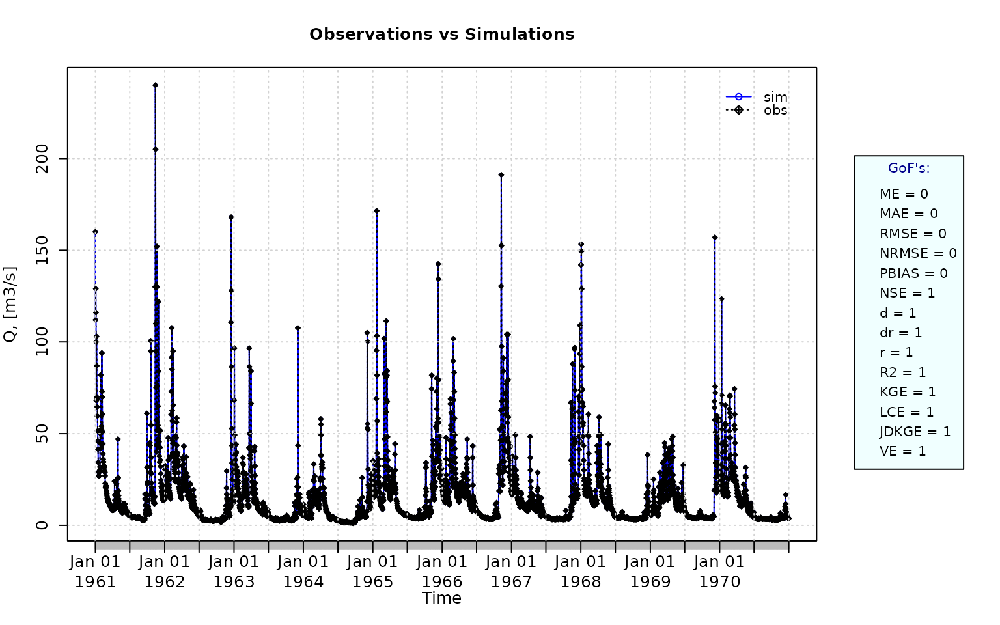

Plotting the graphical comparison of *obs* against *sim*, along with
**user-defined goodness-of-fit measures**:

``` r

ggof(sim, obs, 
     gofs=c( "PBIAS", "dr", "R2",  "NSE", "KGE",  "LCE", "JDKGE", "APFB", "HFB"))
```

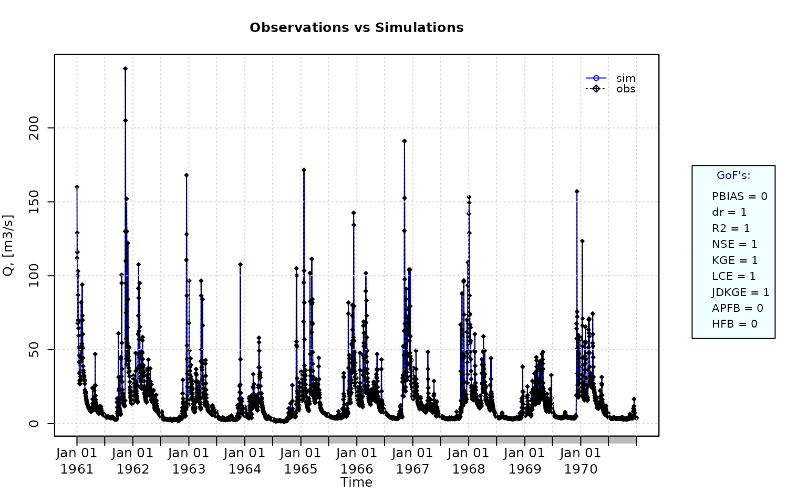

Computing the numeric goodness-of-fit measures for the *best*
(unattainable) case, including the following three measures that -due to
slightly high computation time- are not computed by default: i) the
Spearman’s Rank Correlation Coefficient (rSpearman), ii) the percent
bias in the Slope of the Midsegment of the Flow Duration Curve
(pbiasFDC), and iii) the Proxy for Model Robustness (PMR).

``` r

gof(sim=sim, obs=obs, do.spearman=TRUE, do.pbfdc=TRUE, do.pmr=TRUE)
```

    ##            [,1]
    ## ME            0
    ## MAE           0
    ## MSE           0
    ## RMSE          0
    ## ubRMSE        0
    ## NRMSE %       0
    ## PBIAS %       0
    ## RSR           0
    ## rSD           1
    ## NSE           1
    ## mNSE          1
    ## rNSE          1
    ## wNSE          1
    ## wsNSE         1
    ## d             1
    ## dr            1
    ## md            1
    ## rd            1
    ## cp            1
    ## r             1
    ## R2            1
    ## bR2           1
    ## VE            1
    ## KGE           1
    ## KGElf         1
    ## KGEnp         1
    ## KGEkm         1
    ## JDKGE         1
    ## LME           1
    ## LCE           1
    ## sKGE          1
    ## APFB          0
    ## HFB           0
    ## rSpearman     1
    ## pbiasFDC %    0
    ## PMR           0

- Randomly changing the first 1826 elements of ‘sim’ (half of the ts),
  by using a normal distribution with mean 10 and standard deviation
  equal to 1 (default of ‘rnorm’).

``` r

sim[1:1826] <- obs[1:1826] + rnorm(1826, mean=10)
```

Plotting the graphical comparison of *obs* against *sim*, along with the
**default goodness-of-fit measures** for the daily and monthly time
series:

``` r

ggof(sim=sim, obs=obs, ftype="dm", FUN=mean)
```

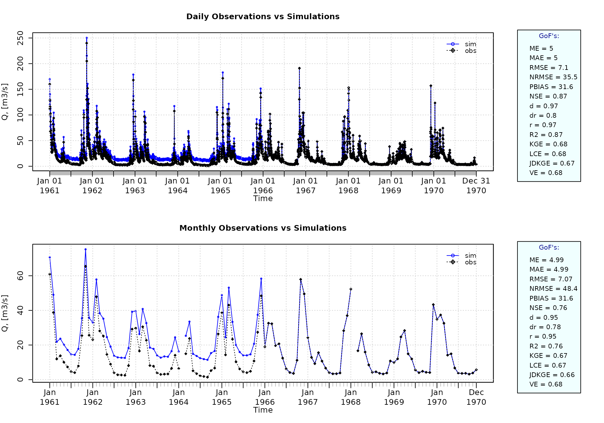

Plotting the graphical comparison of *obs* against *sim*, along with
**user-defined goodness-of-fit measures** for the daily and monthly time
series:

``` r

ggof(sim=sim, obs=obs, ftype="dm", FUN=mean,
     gofs=c( "PBIAS", "dr", "R2",  "NSE", "KGE",  "LCE", "JDKGE", "APFB", "HFB"))
```

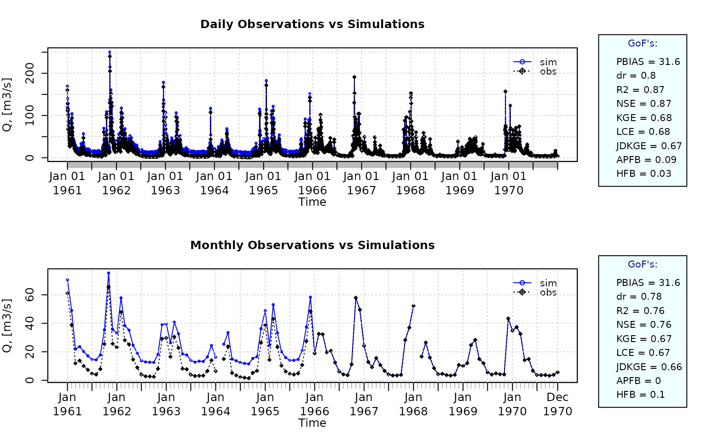

### Removing warm-up period

Using the first two years (1961-1962) as warm-up period, and removing
the corresponding observed and simulated values from the computation of
the goodness-of-fit measures:

``` r

ggof(sim=sim, obs=obs, ftype="dm", FUN=mean, cal.ini="1963-01-01")
```

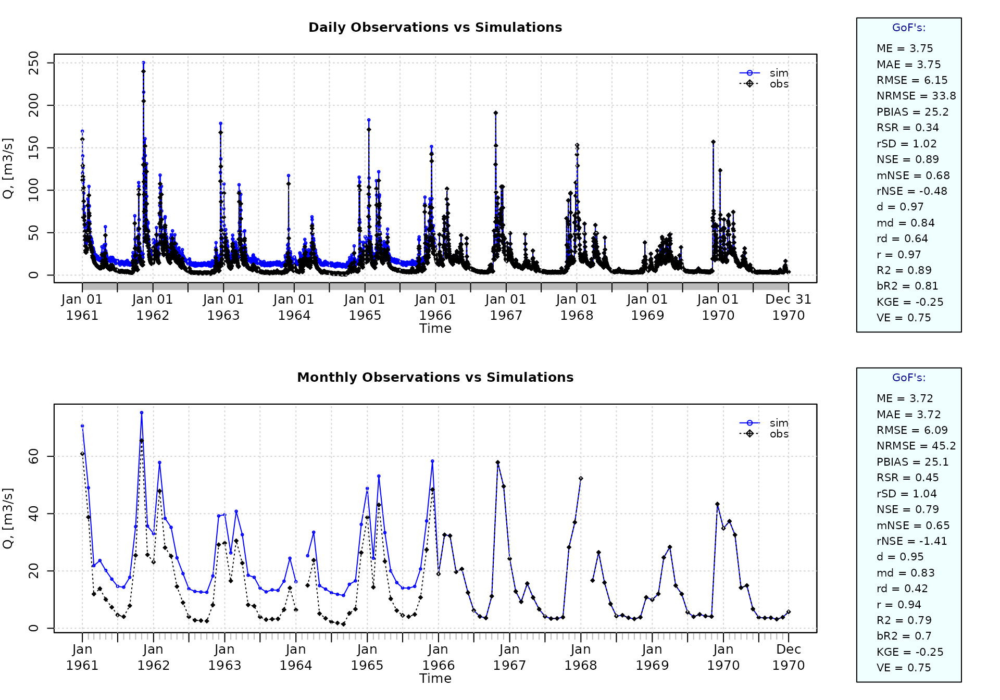

Verification of the goodness-of-fit measures for the daily values after
removing the warm-up period:

``` r

sim <- window(sim, start="1963-01-01")
obs <- window(obs, start="1963-01-01")

gof(sim, obs)
```

    ##          [,1]
    ## ME       3.75
    ## MAE      3.75
    ## MSE     37.84
    ## RMSE     6.15
    ## ubRMSE   4.88
    ## NRMSE % 33.80
    ## PBIAS % 25.20
    ## RSR      0.34
    ## rSD      1.02
    ## NSE      0.89
    ## mNSE     0.68
    ## rNSE    -0.48
    ## wNSE     0.98
    ## wsNSE    0.82
    ## d        0.97
    ## dr       0.84
    ## md       0.84
    ## rd       0.64
    ## cp       0.52
    ## r        0.97
    ## R2       0.89
    ## bR2      0.81
    ## VE       0.75
    ## KGE      0.74
    ## KGElf    0.57
    ## KGEnp    0.69
    ## KGEkm    0.73
    ## JDKGE    0.74
    ## LME      0.75
    ## LCE      0.74
    ## sKGE     0.70
    ## APFB     0.03
    ## HFB      0.00

### Plotting uncertainty bands

Generating fictitious lower and upper uncertainty bounds:

``` r

lband <- obs - 5
uband <- obs + 5
```

Plotting the previously generated uncertainty bands:

``` r

plotbands(obs, lband, uband)
```

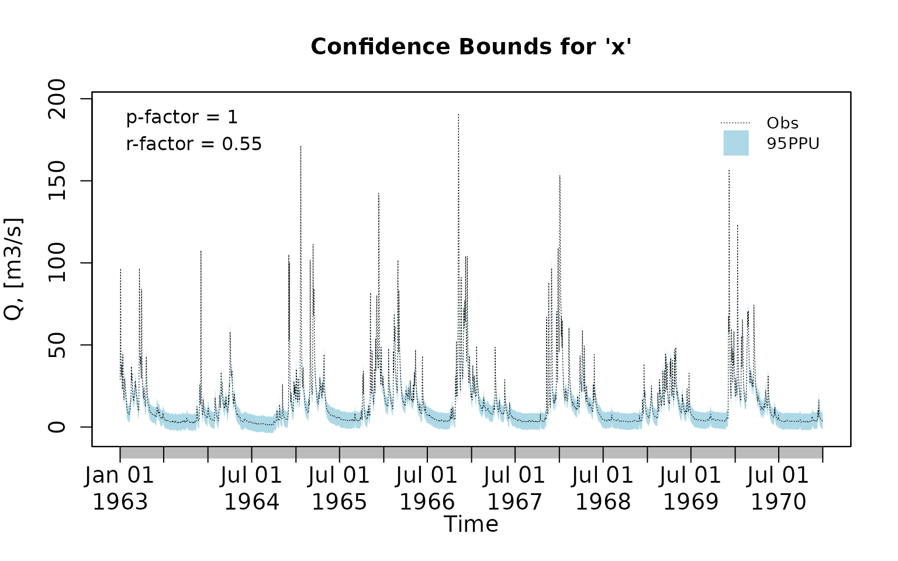

Randomly generating a simulated time series:

``` r

sim <- obs + rnorm(length(obs), mean=3)
```

Plotting the previously generated simulated time series along the
observations and the uncertainty bounds:

``` r

plotbands(obs, lband, uband, sim)
```

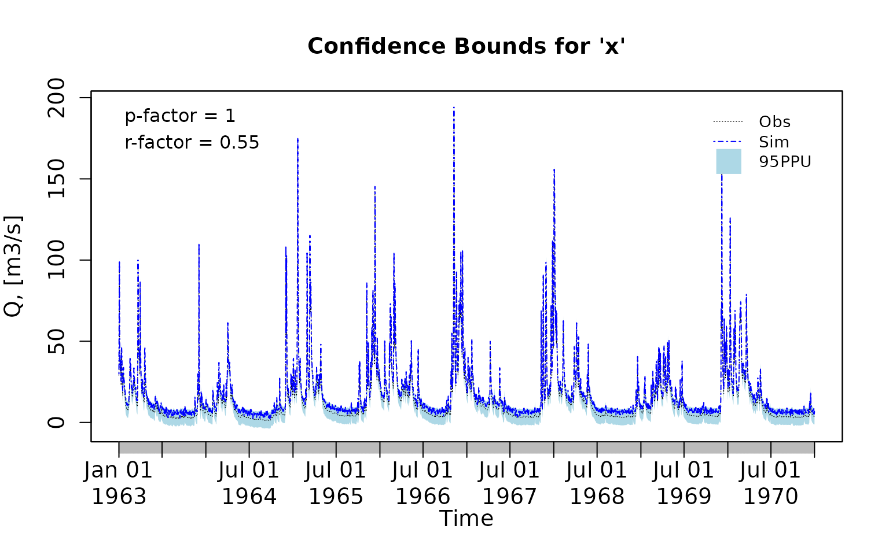

### Computing P-factor

The **P-factor** quantifies the percentage of observed values that fall
within the prediction uncertainty band defined by the lower and upper
bounds. It is a measure of the coverage of the uncertainty interval.

The **P-factor** ranges from 0 to 1. A value of 1 indicates that all
observations are bracketed by the uncertainty bounds, whereas a value of
0 indicates that none of the observations fall within the bounds.

Computing the P-factor:

``` r

( pfactor(x=obs, lband=lband, uband=uband) )
```

    ## [1] 0.9993155

### Computing R-factor

The **R-factor** quantifies the average width of the prediction
uncertainty band relative to the variability of the observed data. It is
a measure of the magnitude of predictive uncertainty associated with a
model simulation.

The **R-factor** ranges from 0 to infinity, with an optimal value of 0
indicating perfect agreement between simulated and observed values
(i.e., zero prediction uncertainty). In practical applications, the
**R-factor** represents the width of the uncertainty interval and should
be as small as possible. Values close to or smaller than 1 are commonly
considered indicative of an acceptable level of predictive uncertainty,
although acceptable thresholds depend on the quality of observations and
the modelling context.

Computing the R-factor:

``` r

( rfactor(x=obs, lband=lband, uband=uband) )
```

    ## [1] 0.5488274

**Important note**:

> Because a larger fraction of observations can often be bracketed by
> widening the uncertainty bounds, the **R-factor** is typically
> interpreted jointly with the **P-factor**. A balance between a high
> **P-factor** (good coverage) and a low **R-factor** (narrow
> uncertainty bounds) is therefore sought during model calibration and
> uncertainty analysis.

### Analysis of the residuals

Computing the daily residuals (even if this is a dummy example, it is
enough for illustrating the capability)

``` r

r <- sim-obs
```

Summarizing and plotting the residuals (it requires the hydroTSM
package):

``` r

library(hydroTSM)
smry(r) 
```

    ##               Index         r
    ## Min.     1963-01-01   -0.3042
    ## 1st Qu.  1964-12-31    2.3620
    ## Median   1966-12-31    3.0400
    ## Mean     1966-12-31    3.0310
    ## 3rd Qu.  1968-12-30    3.7110
    ## Max.     1970-12-31    6.4810
    ## IQR            <NA>    1.3488
    ## sd             <NA>    1.0070
    ## cv             <NA>    0.3323
    ## Skewness       <NA>   -0.0700
    ## Kurtosis       <NA>   -0.0253
    ## NA's           <NA>    2.0000
    ## n              <NA> 2922.0000

``` r

# daily, monthly and annual plots, boxplots and histograms
hydroplot(r, FUN=mean)
```

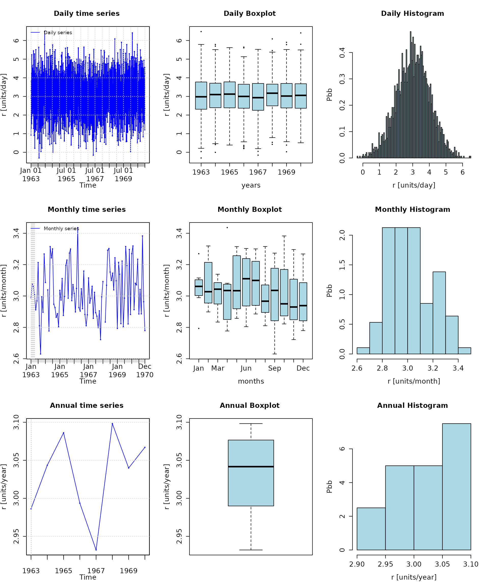

Seasonal plots and boxplots

``` r

# daily, monthly and annual plots, boxplots and histograms
hydroplot(r, FUN=mean, pfreq="seasonal")
```

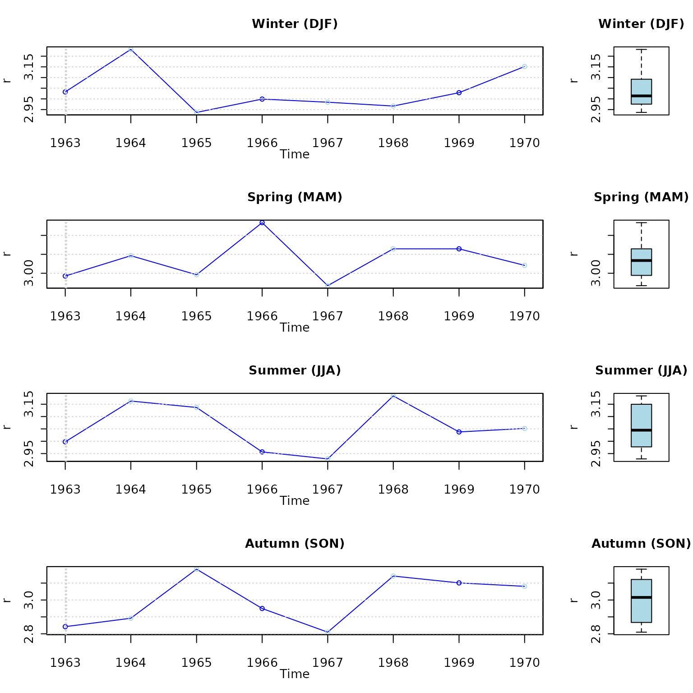

## Software details

This tutorial was built under:

    ## [1] "x86_64-pc-linux-gnu"

    ## [1] "R version 4.6.0 (2026-04-24)"

    ## [1] "hydroGOF 0.6-43"

## Version history of this vignette

- v0.4: 30-Apr-2026
- v0.3: 21-Jan-2024
- v0.2: Mar-2020
- v0.1: Aug 2011
