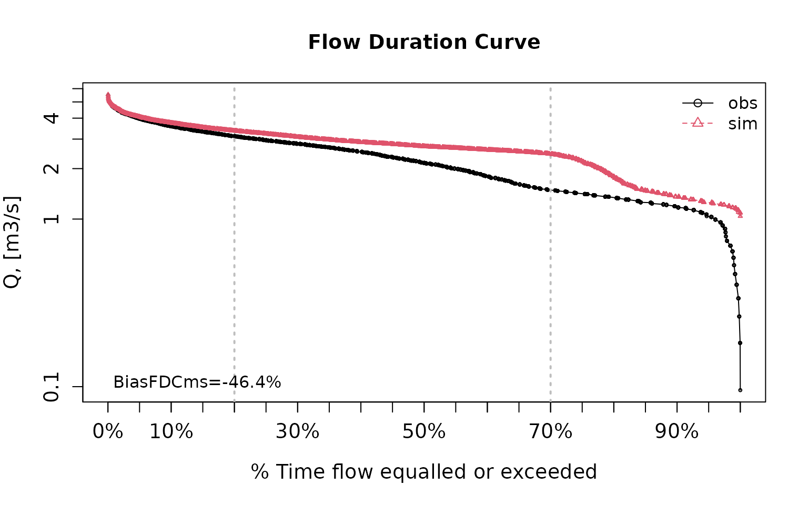
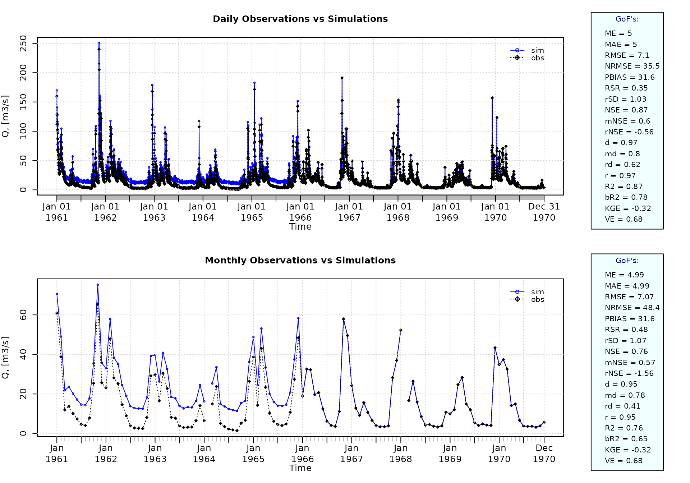

# Goodness-of-fit measures to compare observed and simulated time series with hydroGOF

## Citation

If you use *[hydroGOF](https://cran.r-project.org/package=hydroGOF)*,
please cite it as Zambrano-Bigiarini (2024):

Zambrano-Bigiarini, M. (2024) hydroGOF: Goodness-of-fit functions for
comparison of simulated and observed hydrological time series R package
version 0.5-4. URL: <https://cran.r-project.org/package=hydroGOF>.
<doi:10.5281/zenodo.839854>.

## Installation

Installing the latest stable version (from
[CRAN](https://cran.r-project.org/package=hydroGOF)):

``` r
install.packages("hydroGOF")
```

Alternatively, you can also try the under-development version (from
[Github](https://github.com/hzambran/hydroGOF)):

``` r
if (!require(devtools)) install.packages("devtools")
library(devtools)
install_github("hzambran/hydroGOF")
```

## Setting up the environment

Loading the *hydroGOF* package, which contains data and functions used
in this analysis:

``` r
library(hydroGOF)
```

    ## Loading required package: zoo

    ## 
    ## Attaching package: 'zoo'

    ## The following objects are masked from 'package:base':
    ## 
    ##     as.Date, as.Date.numeric

## Example using NSE

The following examples use the well-known Nash-Sutcliffe efficiency
(NSE), but you can repeat the computations using any of the
goodness-of-fit measures included in the *hydroGOF* package (e.g., KGE,
ubRMSE, dr).

### Example 1

Basic ideal case with a numeric sequence of integers:

``` r
obs <- 1:10
sim <- 1:10
NSE(sim, obs)
```

    ## [1] 1

``` r
obs <- 1:10
sim <- 2:11
NSE(sim, obs)
```

    ## [1] 0.8787879

### Example 2

From this example onwards, a streamflow time series will be used.

First, we load the daily streamflows of the Ega River (Spain), from 1961
to 1970:

``` r
data(EgaEnEstellaQts)
obs <- EgaEnEstellaQts
```

Generating a simulated daily time series, initially equal to the
observed series:

``` r
sim <- obs 
```

Computing the ‘NSE’ for the “best” (unattainable) case

``` r
NSE(sim=sim, obs=obs)
```

    ## [1] 1

### Example 3

NSE for simulated values equal to observations plus random noise on the
first half of the observed values.

This random noise has more relative importance for low flows than for
medium and high flows.

Randomly changing the first 1826 elements of ‘sim’, by using a normal
distribution with mean 10 and standard deviation equal to 1 (default of
‘rnorm’).

``` r
sim[1:1826] <- obs[1:1826] + rnorm(1826, mean=10)
ggof(sim, obs)
```


``` r
NSE(sim=sim, obs=obs)
```

    ## [1] 0.8739885

Let’s have a look at other goodness-of-fit measures:

``` r
mNSE(sim=sim, obs=obs)               # modified NSE
```

    ## [1] 0.6049584

``` r
rNSE(sim=sim, obs=obs)               # relative NSE
```

    ## [1] -0.5687206

``` r
KGE(sim=sim, obs=obs)                # Kling-Gupta efficiency (KGE), 2009
```

    ## [1] -0.3169356

``` r
KGE(sim=sim, obs=obs, method="2012") # Kling-Gupta efficiency (KGE), 2012
```

    ## [1] -0.3338167

``` r
KGElf(sim=sim, obs=obs)              # KGE for low flows
```

    ## [1] -0.07585665

``` r
KGEnp(sim=sim, obs=obs)              # Non-parametric KGE
```

    ## [1] 0.6340134

``` r
sKGE(sim=sim, obs=obs)               # Split KGE
```

    ## [1] -0.3452463

``` r
d(sim=sim, obs=obs)                  # Index of agreement (d)
```

    ## [1] 0.9697286

``` r
rd(sim=sim, obs=obs)                 # Relative d
```

    ## [1] 0.6231506

``` r
md(sim=sim, obs=obs)                 # Modified d
```

    ## [1] 0.7980307

``` r
dr(sim=sim, obs=obs)                 # Refined d
```

    ## [1] 0.8024792

``` r
VE(sim=sim, obs=obs)                 # Volumetric efficiency
```

    ## [1] 0.6838531

``` r
cp(sim=sim, obs=obs)                 # Coefficient of persistence
```

    ## [1] 0.4683536

``` r
pbias(sim=sim, obs=obs)              # Percent bias (PBIAS)
```

    ## [1] 31.6

``` r
pbiasfdc(sim=sim, obs=obs)           # PBIAS in the slope of the midsegment of the FDC
```

    ## [Note: 'thr.shw' was set to FALSE to avoid confusing legends...]


    ## [1] -34.95419

``` r
rmse(sim=sim, obs=obs)               # Root mean square error (RMSE)
```

    ## [1] 7.104063

``` r
ubRMSE(sim=sim, obs=obs)             # Unbiased RMSE
```

    ## [1] 5.047547

``` r
rPearson(sim=sim, obs=obs)           # Pearson correlation coefficient
```

    ## [1] 0.9698058

``` r
rSpearman(sim=sim, obs=obs)          # Spearman rank correlation coefficient
```

    ## [1] 0.8362479

``` r
R2(sim=sim, obs=obs)                 # Coefficient of determination (R2)
```

    ## [1] 0.8739885

``` r
br2(sim=sim, obs=obs)                # R2 multiplied by the slope of the regression line
```

    ## [1] 0.7780545

### Example 4:

NSE for simulated values equal to observations plus random noise on the
first half of the observed values and applying (natural) logarithm to
‘sim’ and ‘obs’ during computations.

``` r
NSE(sim=sim, obs=obs, fun=log)
```

    ## [1] 0.4799297

Verifying the previous value:

``` r
lsim <- log(sim)
lobs <- log(obs)
NSE(sim=lsim, obs=lobs)
```

    ## [1] 0.4799297

Let’s have a look at other goodness-of-fit measures:

``` r
mNSE(sim=sim, obs=obs, fun=log)               # modified NSE
```

    ## [1] 0.4822804

``` r
rNSE(sim=sim, obs=obs, fun=log)               # relative NSE
```

    ## [1] -4.560383

``` r
KGE(sim=sim, obs=obs, fun=log)                # Kling-Gupta efficiency (KGE), 2009
```

    ## [1] -0.20655

``` r
KGE(sim=sim, obs=obs, method="2012", fun=log) # Kling-Gupta efficiency (KGE), 2012
```

    ## [1] -0.2279992

``` r
KGElf(sim=sim, obs=obs)                       # KGE for low flows (it does not allow 'fun' argument)
```

    ## [1] -0.07585665

``` r
KGEnp(sim=sim, obs=obs, fun=log)              # Non-parametric KGE
```

    ## [1] 0.7437751

``` r
sKGE(sim=sim, obs=obs, fun=log)               # Split KGE
```

    ## [1] -0.4594372

``` r
d(sim=sim, obs=obs, fun=log)                  # Index of agreement (d)
```

    ## [1] 0.8609788

``` r
rd(sim=sim, obs=obs, fun=log)                 # Relative d
```

    ## [1] -0.4863585

``` r
md(sim=sim, obs=obs, fun=log)                 # Modified d
```

    ## [1] 0.7385673

``` r
dr(sim=sim, obs=obs, fun=log)                 # Refined d
```

    ## [1] 0.7411402

``` r
VE(sim=sim, obs=obs, fun=log)                 # Volumetric efficiency
```

    ## [1] 0.8124419

``` r
cp(sim=sim, obs=obs, fun=log)                 # Coefficient of persistence
```

    ## [1] -7.948224

``` r
pbias(sim=sim, obs=obs, fun=log)              # Percent bias (PBIAS)
```

    ## [1] 18.8

``` r
pbiasfdc(sim=sim, obs=obs, fun=log)           # PBIAS in the slope of the midsegment of the FDC
```

    ## [Note: 'thr.shw' was set to FALSE to avoid confusing legends...]



    ## [1] -46.39001

``` r
rmse(sim=sim, obs=obs, fun=log)               # Root mean square error (RMSE)
```

    ## [1] 0.6955452

``` r
ubRMSE(sim=sim, obs=obs, fun=log)             # Unbiased RMSE
```

    ## [1] 0.5520467

``` r
rPearson(sim=sim, obs=obs, fun=log)           # Pearson correlation coefficient (r)
```

    ## [1] 0.8221915

``` r
rSpearman(sim=sim, obs=obs, fun=log)          # Spearman rank correlation coefficient (rho)
```

    ## [1] 0.8362479

``` r
R2(sim=sim, obs=obs, fun=log)                 # Coefficient of determination (R2)
```

    ## [1] 0.4799297

``` r
br2(sim=sim, obs=obs, fun=log)                # R2 multiplied by the slope of the regression line
```

    ## [1] 0.4299904

### Example 5

NSE for simulated values equal to observations plus random noise on the
first half of the observed values and applying (natural) logarithm to
‘sim’ and ‘obs’ and adding the Pushpalatha2012 constant during
computations

``` r
NSE(sim=sim, obs=obs, fun=log, epsilon.type="Pushpalatha2012")
```

    ## [1] 0.4871177

Verifying the previous value, with the epsilon value following
Pushpalatha2012:

``` r
eps  <- mean(obs, na.rm=TRUE)/100
lsim <- log(sim+eps)
lobs <- log(obs+eps)
NSE(sim=lsim, obs=lobs)
```

    ## [1] 0.4871177

Let’s have a look at other goodness-of-fit measures:

``` r
gof(sim=sim, obs=obs, fun=log, epsilon.type="Pushpalatha2012", do.spearman=TRUE, do.pbfdc=TRUE)
```

    ##              [,1]
    ## ME           0.41
    ## MAE          0.41
    ## MSE          0.46
    ## RMSE         0.68
    ## ubRMSE       0.54
    ## NRMSE %     71.60
    ## PBIAS %     18.20
    ## RSR          0.72
    ## rSD          0.89
    ## NSE          0.49
    ## mNSE         0.48
    ## rNSE        -2.08
    ## wNSE         0.74
    ## wsNSE        0.78
    ## d            0.86
    ## dr           0.74
    ## md           0.74
    ## rd           0.18
    ## cp          -7.68
    ## r            0.83
    ## R2           0.49
    ## bR2          0.44
    ## VE           0.82
    ## KGE         -0.20
    ## KGElf       -0.08
    ## KGEnp        0.74
    ## KGEkm        0.74
    ## sKGE        -0.39
    ## APFB         0.01
    ## HFB          0.98
    ## rSpearman    0.84
    ## pbiasFDC % -45.87

### Example 6

NSE for simulated values equal to observations plus random noise on the
first half of the observed values and applying (natural) logarithm to
‘sim’ and ‘obs’ and adding a user-defined constant during computations

``` r
eps <- 0.01
NSE(sim=sim, obs=obs, fun=log, epsilon.type="otherValue", epsilon.value=eps)
```

    ## [1] 0.4804

Verifying the previous value:

``` r
lsim <- log(sim+eps)
lobs <- log(obs+eps)
NSE(sim=lsim, obs=lobs)
```

    ## [1] 0.4804

Let’s have a look at other goodness-of-fit measures:

``` r
gof(sim=sim, obs=obs, fun=log, epsilon.type="otherValue", epsilon.value=eps, do.spearman=TRUE, do.pbfdc=TRUE)
```

    ##              [,1]
    ## ME           0.42
    ## MAE          0.42
    ## MSE          0.48
    ## RMSE         0.69
    ## ubRMSE       0.55
    ## NRMSE %     72.10
    ## PBIAS %     18.70
    ## RSR          0.72
    ## rSD          0.88
    ## NSE          0.48
    ## mNSE         0.48
    ## rNSE        -4.22
    ## wNSE         0.74
    ## wsNSE        0.78
    ## d            0.86
    ## dr           0.74
    ## md           0.74
    ## rd          -0.39
    ## cp          -7.93
    ## r            0.82
    ## R2           0.48
    ## bR2          0.43
    ## VE           0.81
    ## KGE         -0.21
    ## KGElf       -0.08
    ## KGEnp        0.74
    ## KGEkm        0.73
    ## sKGE        -0.45
    ## APFB         0.01
    ## HFB          0.98
    ## rSpearman    0.84
    ## pbiasFDC % -46.36

### Example 7

NSE for simulated values equal to observations plus random noise on the
first half of the observed values and applying (natural) logarithm to
‘sim’ and ‘obs’ and using a user-defined factor to multiply the mean of
the observed values to obtain the constant to be added to ‘sim’ and
‘obs’ during computations

``` r
fact <- 1/50
NSE(sim=sim, obs=obs, fun=log, epsilon.type="otherFactor", epsilon.value=fact)
```

    ## [1] 0.4938294

Verifying the previous value:

``` r
fact <- 1/50
eps  <- fact*mean(obs, na.rm=TRUE)
lsim <- log(sim+eps)
lobs <- log(obs+eps)
NSE(sim=lsim, obs=lobs)
```

    ## [1] 0.4938294

Let’s have a look at other goodness-of-fit measures:

``` r
gof(sim=sim, obs=obs, fun=log, epsilon.type="otherFactor", epsilon.value=fact, do.spearman=TRUE, do.pbfdc=TRUE)
```

    ##              [,1]
    ## ME           0.41
    ## MAE          0.41
    ## MSE          0.44
    ## RMSE         0.66
    ## ubRMSE       0.52
    ## NRMSE %     71.10
    ## PBIAS %     17.60
    ## RSR          0.71
    ## rSD          0.89
    ## NSE          0.49
    ## mNSE         0.48
    ## rNSE        -1.33
    ## wNSE         0.74
    ## wsNSE        0.78
    ## d            0.87
    ## dr           0.74
    ## md           0.74
    ## rd           0.38
    ## cp          -7.43
    ## r            0.83
    ## R2           0.49
    ## bR2          0.44
    ## VE           0.82
    ## KGE         -0.19
    ## KGElf       -0.07
    ## KGEnp        0.74
    ## KGEkm        0.75
    ## sKGE        -0.35
    ## APFB         0.01
    ## HFB          0.98
    ## rSpearman    0.84
    ## pbiasFDC % -45.37

### Example 8

NSE for simulated values equal to observations plus random noise on the
first half of the observed values and applying a user-defined function
to ‘sim’ and ‘obs’ during computations:

``` r
fun1 <- function(x) {sqrt(x+1)}
NSE(sim=sim, obs=obs, fun=fun1)
```

    ## [1] 0.7265255

Verifying the previous value, with the epsilon value following
Pushpalatha2012:

``` r
sim1 <- sqrt(sim+1)
obs1 <- sqrt(obs+1)
NSE(sim=sim1, obs=obs1)
```

    ## [1] 0.7265255

``` r
gof(sim=sim, obs=obs, fun=fun1, do.spearman=TRUE, do.pbfdc=TRUE)
```

    ##              [,1]
    ## ME           0.65
    ## MAE          0.65
    ## MSE          0.92
    ## RMSE         0.96
    ## ubRMSE       0.71
    ## NRMSE %     52.30
    ## PBIAS %     17.70
    ## RSR          0.52
    ## rSD          0.97
    ## NSE          0.73
    ## mNSE         0.54
    ## rNSE         0.34
    ## wNSE         0.89
    ## wsNSE        0.76
    ## d            0.93
    ## dr           0.77
    ## md           0.76
    ## rd           0.83
    ## cp          -1.17
    ## r            0.92
    ## R2           0.73
    ## bR2          0.65
    ## VE           0.82
    ## KGE         -0.18
    ## KGElf       -0.08
    ## KGEnp        0.75
    ## KGEkm        0.80
    ## sKGE        -0.09
    ## APFB         0.02
    ## HFB          0.96
    ## rSpearman    0.84
    ## pbiasFDC % -32.96

## A short example from hydrological modelling

Loading observed streamflows of the Ega River (Spain), with daily data
from 1961-Jan-01 up to 1970-Dec-31

``` r
require(zoo)
data(EgaEnEstellaQts)
obs <- EgaEnEstellaQts
```

Generating a simulated daily time series, initially equal to the
observed values (simulated values are usually read from the output files
of the hydrological model)

``` r
sim <- obs 
```

Computing the numeric goodness-of-fit measures for the “best”
(unattainable) case

``` r
gof(sim=sim, obs=obs)
```

    ##         [,1]
    ## ME         0
    ## MAE        0
    ## MSE        0
    ## RMSE       0
    ## ubRMSE     0
    ## NRMSE %    0
    ## PBIAS %    0
    ## RSR        0
    ## rSD        1
    ## NSE        1
    ## mNSE       1
    ## rNSE       1
    ## wNSE       1
    ## wsNSE      1
    ## d          1
    ## dr         1
    ## md         1
    ## rd         1
    ## cp         1
    ## r          1
    ## R2         1
    ## bR2        1
    ## VE         1
    ## KGE        0
    ## KGElf      0
    ## KGEnp      1
    ## KGEkm      1
    ## sKGE       0
    ## APFB       0
    ## HFB        1

- Randomly changing the first 1826 elements of ‘sim’ (half of the ts),
  by using a normal distribution with mean 10 and standard deviation
  equal to 1 (default of ‘rnorm’).

``` r
sim[1:1826] <- obs[1:1826] + rnorm(1826, mean=10)
```

Plotting the graphical comparison of ‘obs’ against ‘sim’, along with the
numeric goodness-of-fit measures for the daily and monthly time series

``` r
ggof(sim=sim, obs=obs, ftype="dm", FUN=mean)
```



### Removing warm-up period

Using the first two years (1961-1962) as warm-up period, and removing
the corresponding observed and simulated values from the computation of
the goodness-of-fit measures:

``` r
ggof(sim=sim, obs=obs, ftype="dm", FUN=mean, cal.ini="1963-01-01")
```


Verification of the goodness-of-fit measures for the daily values after
removing the warm-up period:

``` r
sim <- window(sim, start="1963-01-01")
obs <- window(obs, start="1963-01-01")

gof(sim, obs)
```

    ##          [,1]
    ## ME       3.75
    ## MAE      3.75
    ## MSE     37.84
    ## RMSE     6.15
    ## ubRMSE   4.88
    ## NRMSE % 33.80
    ## PBIAS % 25.20
    ## RSR      0.34
    ## rSD      1.02
    ## NSE      0.89
    ## mNSE     0.68
    ## rNSE    -0.48
    ## wNSE     0.98
    ## wsNSE    0.82
    ## d        0.97
    ## dr       0.84
    ## md       0.84
    ## rd       0.64
    ## cp       0.52
    ## r        0.97
    ## R2       0.89
    ## bR2      0.81
    ## VE       0.75
    ## KGE     -0.25
    ## KGElf   -0.06
    ## KGEnp    0.69
    ## KGEkm    0.73
    ## sKGE    -0.30
    ## APFB     0.03
    ## HFB      1.00

### Plotting uncertainty bands

Generating fictitious lower and upper uncertainty bounds:

``` r
lband <- obs - 5
uband <- obs + 5
plotbands(obs, lband, uband)
```


Plotting the previously generated uncertainty bands:

``` r
plotbands(obs, lband, uband)
```


Randomly generating a simulated time series:

``` r
sim <- obs + rnorm(length(obs), mean=3)
```

Plotting the previously generated simualted time series along the
obsertations and the uncertainty bounds:

``` r
plotbands(obs, lband, uband, sim)
```


### Analysis of the residuals

Computing the daily residuals (even if this is a dummy example, it is
enough for illustrating the capability)

``` r
r <- sim-obs
```

Summarizing and plotting the residuals (it requires the hydroTSM
package):

``` r
library(hydroTSM)
smry(r) 
```

    ##               Index         r
    ## Min.     1963-01-01   -0.3042
    ## 1st Qu.  1964-12-31    2.3620
    ## Median   1966-12-31    3.0400
    ## Mean     1966-12-31    3.0310
    ## 3rd Qu.  1968-12-30    3.7110
    ## Max.     1970-12-31    6.4810
    ## IQR            <NA>    1.3488
    ## sd             <NA>    1.0070
    ## cv             <NA>    0.3323
    ## Skewness       <NA>   -0.0700
    ## Kurtosis       <NA>   -0.0253
    ## NA's           <NA>    2.0000
    ## n              <NA> 2922.0000

``` r
# daily, monthly and annual plots, boxplots and histograms
hydroplot(r, FUN=mean)
```


Seasonal plots and boxplots

``` r
# daily, monthly and annual plots, boxplots and histograms
hydroplot(r, FUN=mean, pfreq="seasonal")
```


## Software details

This tutorial was built under:

    ## [1] "x86_64-pc-linux-gnu"

    ## [1] "R version 4.6.0 (2026-04-24)"

    ## [1] "hydroGOF 0.6-32"

## Version history

- v0.3: Jan-2024
- v0.2: Mar-2020
- v0.1: Aug 2011
